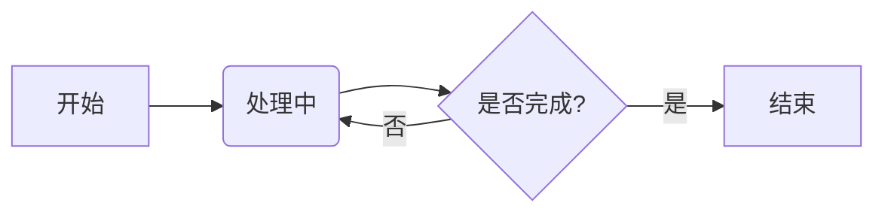

# 🎨 My Canvas Blog · 极简主义排版与摄影主题

> 基于 **Astro**、**Pretext** 与 **Nord 调色系统** 构建的极简高性能个人博客与摄影画廊主题。  
> 专为技术写作、数字排版美学与沉浸式摄影展示设计。

<p align="center">
  
  
  
  
  
</p>

---

## 🌟 主题核心特色

### 1. 📖 纯粹的排版流与阅读体验
- **Nord 浅色美学体系**：全局采用北欧冰雪色系（`#5E81AC`, `#88C0D0`, `#2E3440`, `#ECEFF4`），字阶明晰、行距考究（`1.86` 倍行高与适度行宽）。
- **Monaspace Krypton 字体加持**：深度集成 GitHub 专为代码与排版设计的优质字体栈。
- **全宽左右贯穿 Banner**：文章主视觉 Banner 采用 `100vw` 左右贯穿沉浸式布局，在任何设备上均保持纯粹通透。
- **Pretext Canvas 排版实验**：引入 `@chenglou/pretext` 探索基于 Canvas 精确测量的现代 Web 文本排版与交互引力场动效。

### 2. ⚡ 全站 PJAX / SPA 极速无刷新转场
- **Astro ClientRouter 深度整合**：全站页面（首页、文章列表、详情页、画廊展厅、归档、关于）无刷新丝滑过渡，消除白屏等待。
- **顶部 Nord 渐变加载进度条**：随路由切换事件（`astro:before-preparation` / `astro:page-load`）动态展现柔和的渐变加载指示。
- **生命周期安全防内存泄漏**：所有事件监听器、灯箱与图表渲染器均接入生命周期清理机制，保证长时间浏览零卡顿。

### 3. 📊 现代化 Mermaid 矢量图表引擎
- **按需异步动态加载**：仅当 Markdown 中包含 ```` ```mermaid ```` 代码块时才会客户端异步加载，纯文本页面首屏零体积开销。
- **图表 / 源码一键切换**：支持随时在渲染后的 SVG 图表与 Markdown 原始代码之间无缝切换。
- **全屏模态放大查看**：复杂流程图与状态机支持一键居中全屏灯箱放大查看，支持 `Esc` 键与手势关闭。
- **一键复制代码与错误兜底**：带状态反馈的代码复制按钮；若图表语法有误自动降级展示，绝不破坏页面排版。

### 4. 🧭 智能双端目录 (Table of Contents & ScrollSpy)
- **桌面端粘性吸顶**：右侧边栏 `position: sticky` 随滚动固定吸顶，带独立的溢出平滑滚动。
- **双向 ScrollSpy 实时高亮**：正文滚动时实时定位当前阅读小节，高亮目录项并点亮 Nord 蓝发光圆点。
- **移动端正圆形悬浮按钮 (FAB) & 抽屉面板**：
  - `<= 1024px` 屏幕下自动隐藏右侧边栏，呼出与回到顶部按钮风格一致的极简正圆形目录按钮。
  - 点击滑出毛玻璃抽屉面板（Bottom Sheet），支持多级层级缩进。
  - 点击任意章节平滑滚动并**自动关闭抽屉**，支持点击背景或按下 `Esc` 退出。

### 5. 📷 展厅级摄影画廊与原生 EXIF 参数解析
- **双展示模式**：
  - **画廊展厅（Wall 模式）**：暗黑策展模式（Dark Gallery Mode），5 列纯净平铺无缝照片墙，支持 F11 浏览器全屏沉浸展卷。
  - **首页画集（Album 模式）**：包含画册年份徽标、策展人手记与智能自适应图片并排网格。
- **沉浸式展卷阅读器 (Book Lightbox)**：
  - 左右平滑切图、键盘方向键导航、序号计数器。
  - **原生 EXIF 解析**：自动从摄影原图提取相机机身、镜头型号、焦距、光圈、快门速度、ISO 等拍摄参数，以优雅卡片展示。

### 6. 🛠️ 丰富的文章增强组件
- **顶部阅读进度条**：固定在屏幕最顶部，直观反馈阅读进度。
- **代码块语言徽标 + 复制工具栏**：支持主流语言语法高亮与一键复制代码。
- **表格自动包裹滚动容器**：自动识别 Markdown 生成的 `<table>` 并封装横向滚动容器，彻底告别移动端横向抖动。
- **上下篇快速跳转卡片**：文章末尾自动计算相邻文章并生成双栏导航卡片。
- **首页实时天文/公历元数据**：封面实时更新当前公历、农历与秒级时间戳。

---

## 🏗️ 项目目录结构

```text
my-canvas-blog/
├── public/                     # 静态资源 (封面、头像、图标、画廊作品)
│   ├── covers/                 # 封面图集合
│   └── post_pic/               # 文章内插图与 SVG 矢量图
├── src/
│   ├── components/             # 核心 UI 组件
│   │   ├── ArtBookSpread.astro # 摄影画册与照片墙展卷组件
│   │   ├── BookLightbox.astro  # 画集灯箱与 EXIF 元数据展示器
│   │   ├── PostList.astro      # 首页文章/画集双视图切换列表
│   │   └── SiteHeader.astro    # 顶部极简导航栏
│   ├── content/                # 文章内容集合 (Content Collections)
│   │   └── posts/              # Markdown 博文源文件
│   │       ├── vcu_test.md
│   │       └── mermaid-showcase.md
│   ├── data/
│   │   └── galleryItems.ts     # 画廊摄影集与作品数据集
│   ├── layouts/
│   │   └── BaseLayout.astro    # 全局基础布局 (集成 ClientRouter PJAX)
│   ├── lib/
│   │   ├── config.ts           # 博客全站全局站点配置
│   │   ├── exifLoader.ts       # 原生 EXIF 参数提取与格式化
│   │   ├── homepageCover.ts    # 首页封面与实时时间快照算法
│   │   └── mermaid.ts          # Mermaid 客户端渲染与灯箱控制逻辑
│   ├── pages/                  # 文件路由
│   │   ├── 404.astro           # 404 缺省页
│   │   ├── about.astro         # 关于页面
│   │   ├── archive.astro       # 年份时间线归档页面
│   │   ├── gallery/index.astro # 独立暗黑画廊展厅
│   │   ├── posts/[slug].astro  # 文章详情页 (集成 TOC、代码工具栏、Mermaid)
│   │   ├── index.astro         # 博客首页
│   │   └── rss.xml.ts          # RSS 订阅源生成器
│   └── styles/
│       ├── global.css          # 全局排版与 Nord 颜色变量
│       └── nord-light-theme.json
├── astro.config.mjs            # Astro 项目配置 (集成 sitemap)
├── package.json
└── tsconfig.json
```

---

## 🚀 快速上手

### 1. 环境准备
- Node.js `>= 22.12.0`
- 包管理器推荐使用 `npm` 或 `pnpm`

### 2. 安装与运行
```bash
# 克隆仓库
git clone https://github.com/M-Crowe/blog-new.git
cd blog-new

# 安装依赖包
npm install

# 启动本地开发服务 (默认 http://localhost:4321)
npm run dev

# 类型与语法检查
npm run check

# 生产环境打包编译 (输出到 ./dist 目录)
npm run build

# 本地预览构建产物
npm run preview
```

---

## ⚙️ 个性化配置指南

### 1. 站点全局信息配置 (`src/lib/config.ts`)
在 `src/lib/config.ts` 中可以统一修改站点名称、作者简介、社交媒体链接以及页脚版权信息：

```typescript
export const siteConfig = {
  site: {
    name: "Marinus's Blog",
    title: "Marinus's Blog | 设计、排版与技术随笔",
    description: "记录技术、设计与审美的交叉点。分享前端工程化、排版与生活日常。",
    url: "https://your-domain.com",
  },
  author: {
    name: "Marinus Crowe",
    bio: "前端开发者 / 极简主义爱好者 / 业余摄影师",
    avatar: "/covers/spings/night.jpg",
    github: "https://github.com/M-Crowe",
    email: "your-email@example.com",
  },
  nav: [
    { label: "首页", href: "/" },
    { label: "归档", href: "/archive" },
    { label: "画廊", href: "/gallery" },
    { label: "关于", href: "/about" },
  ],
  footer: {
    copyright: "© 2026 Marinus's Blog. Built with Astro & Pretext.",
    desc: "记录技术、排版美学与生活痕迹。",
  },
};
```

### 2. 发布新博文 (`src/content/posts/`)
在 `src/content/posts/` 目录下创建 `.md` 格式的 Markdown 文件：

```markdown
---
title: "你的文章标题"
date: 2026-09-19
excerpt: "简明扼要的文章摘要介绍"
tags: ["前端", "Astro", "设计"]
cover: "/covers/spings/night.jpg"
author: "Marinus Crowe"
aiGenerated: false
---

## 第一章节

正文内容...

### 绘制 Mermaid 图表


```

### 3. 配置摄影画廊作品 (`src/data/galleryItems.ts`)
在 `src/data/galleryItems.ts` 中新增或编辑画册（Volume）与作品（Item）：

```typescript
export const artVolumes: ArtVolume[] = [
  {
    volId: 'vol-2026-spring',
    volNumber: 'VOL. 01',
    year: '2026',
    title: '春影幽光 · 摄影画集',
    subtitle: '春夜与暗光下的花卉微距探索',
    curatorNote: '记录春季暗光环境下的自然质感与微弱光影。',
    items: [
      {
        id: 'spring-blossom-01',
        title: '幽夜海棠',
        image: '/covers/spings/night.jpg',
        plateNumber: '№ 01',
        category: 'Night / Blossom',
        place: '中国 · 镇江',
        dateLabel: '2026年4月',
        story: '微风拂过的暗夜，借由路灯漫反射记录下的海棠花姿。',
        exif: {
          camera: 'Fujifilm X-T5',
          lens: 'XF 33mm F1.4 R LM WR',
          focalLength: '33mm',
          aperture: 'f/1.4',
          shutter: '1/125s',
          iso: 'ISO 400',
        }
      }
    ]
  }
];
```

---

## 🚢 部署说明

本博客输出为纯静态 HTML/CSS/JS 产物，可零配置一键部署到任意现代托管平台：

- **Cloudflare Pages**：构建命令 `npm run build`，输出目录 `dist`。
- **Vercel**：Framework Preset 选择 `Astro`。
- **GitHub Pages**：通过 GitHub Actions 执行 `astro build` 并将 `dist` 推送至 `gh-pages` 分支。

---

## 📄 开源许可证

本项目基于 [MIT License](LICENSE) 开源。欢迎自由使用、修改与衍生你的个性化博客主题。
