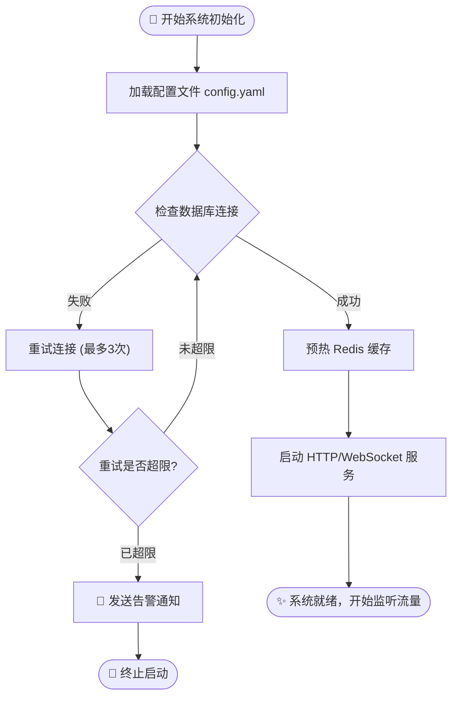
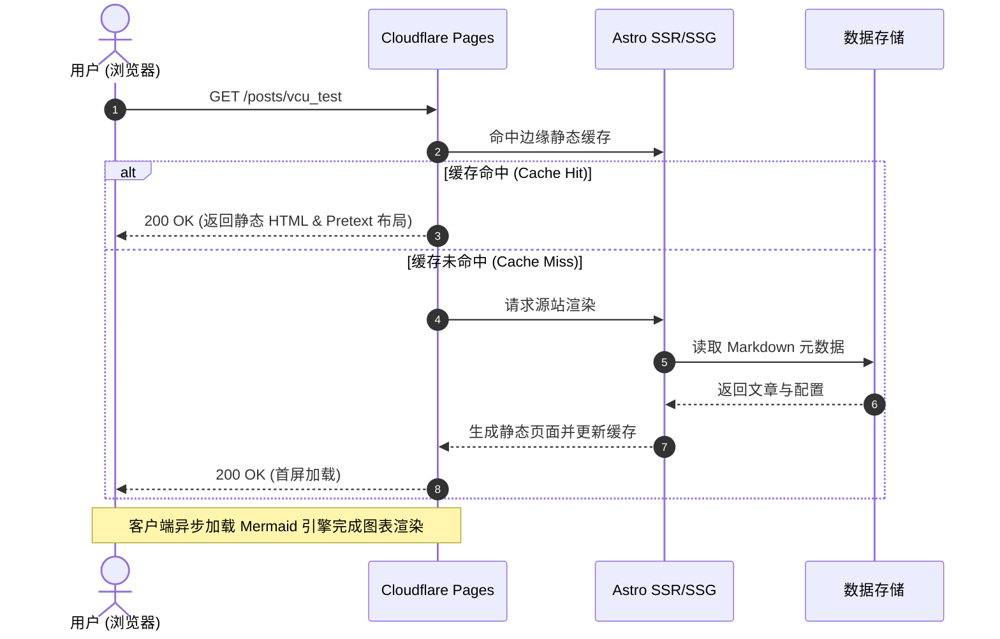
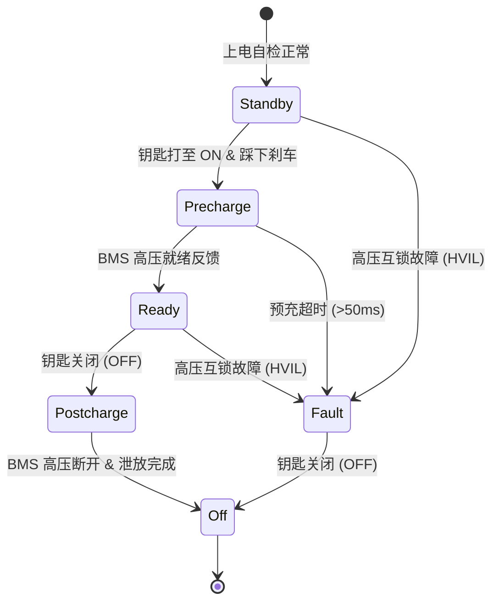
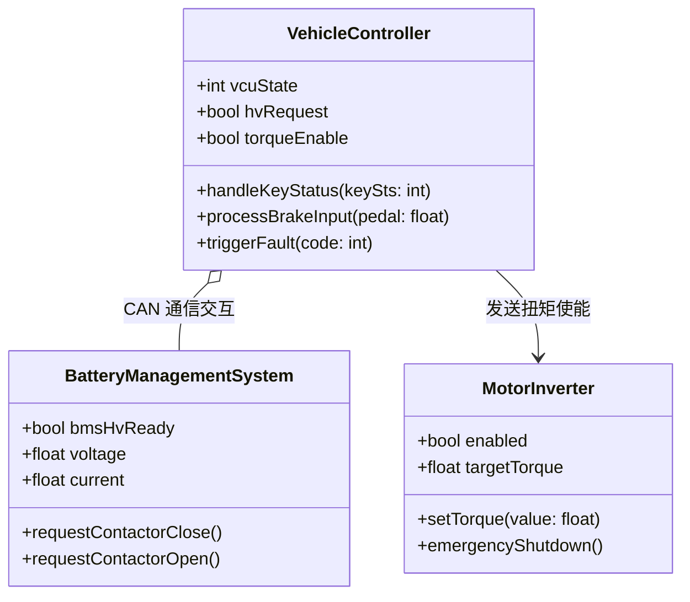
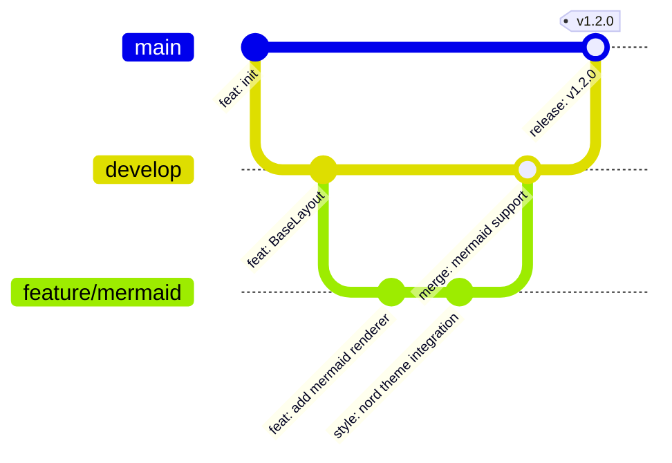
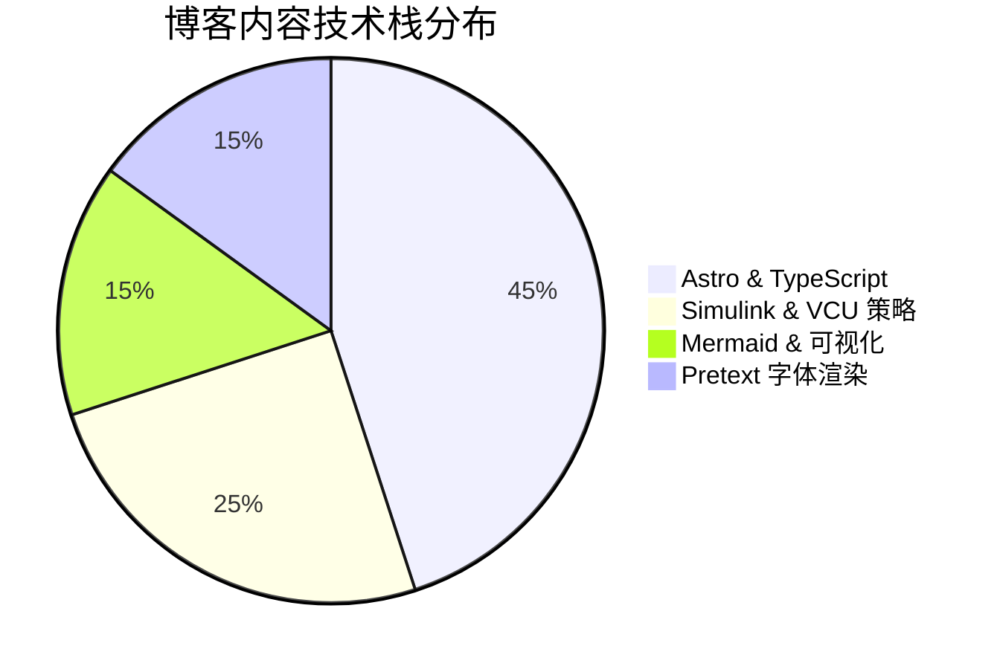

本文用于测试与演示博客系统对 **Mermaid.js** 各种常用图表类型的渲染效果与交互特性。

## 1. 流程图 (Flowchart)

## 2. 时序图 (Sequence Diagram)

## 3. 状态图 (State Diagram)

## 4. 类图 (Class Diagram)

## 5. Git 分支图 (Git Graph)

## 6. 饼图数据分析 (Pie Chart)

