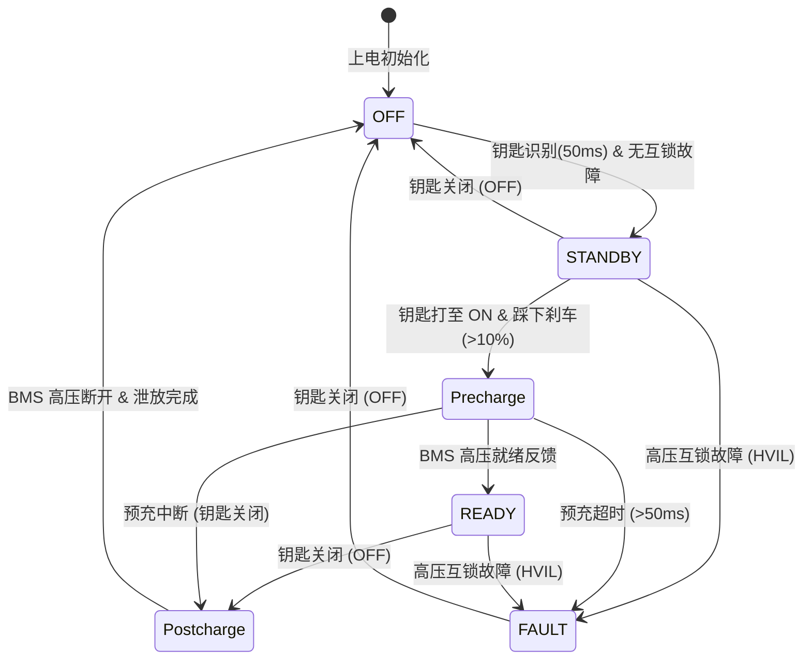
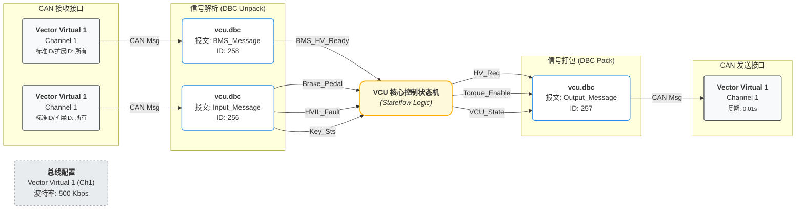

## 工具一览

| 分类           | 工具/技术栈                         | 主要用途描述                          |
|:------------ |:------------------------------ |:------------------------------- |
| **策略建模**     | Simulink/Stateflow             | 负责 VCU 上下电控制逻辑建模与有限状态机设计        |
| **测试框架**     | pytest                         | 用于编写和执行自动化测试脚本及断言校验             |
| **CAN通信**    | python-can, vector virtual can | 用于通过 Python 操作 CAN 总线，实现仿真与报文收发 |
| **版本/代码托管**  | Gitea, Jenkins                 | 内部 Git 托管平台，管理控制策略与测试脚本源码       |
| **容器与CI/CD** | Docker                         | 构建标准化测试环境，结合 CI/CD 自动化执行测试流水线   |

## 上下电状态机建模

### 信号说明

| 输入信号             | 信号功能说明     | 输出信号              | 信号功能说明        |
|:---------------- | ---------- |:----------------- |:------------- |
| **Key_Sts**      | 钥匙/点火开关状态  | **VCU_State**     | 系统主状态机枚举值     |
| **Brake_Pedal**  | 刹车踏板开度信号   | **HV_Req**        | BMS 高压接触器闭合请求 |
| **BMS_HV_Ready** | BMS 高压就绪反馈 | **Torque_Enable** | 驱动电机扭矩使能标志    |
| **HVIL_Fault**   | 高压回路互锁故障标志 |                   |               |

### VCU 上下电控制策略状态机图

#### 转移条件说明

**上电过程:**

1. 车辆进入待机状态 `OFF -> STANDBY` 需满足 2 个条件，此时 VCU_State 由 0 -> 1：
   - 车内识别到钥匙且持续 50ms (`duration(Key_Sts == 1, 50ms)`)
   - 无高压回路互锁故障 (`HVIL_Fault == 0`)

2. 进入高压预充状态 `STANDBY -> Precharge` 需要满足 3 个条件，此时 VCU_State 由 1 -> 2，并请求 BMS 高压闭合 (`HV_Req = 1`)：
   - 钥匙处于启动状态 (`Key_Sts == 2`)
   - 无高压回路互锁故障 (`HVIL_Fault == 0`)
   - 刹车踏板行程 > 10% (`Brake_Pedal > 10`)

3. 进入可行驶状态 `Precharge -> READY` 需要 BMS 高压就绪，此时 VCU_State 由 2 -> 3，发送转矩使能信号 (`Torque_Enable = 1`)：
   - `BMS_HV_Ready == 1`

**下电过程:**

1. 高压下电泄放 `READY -> Postcharge`：钥匙状态为离车状态 (`Key_Sts == 0`)，系统发出 BMS 下电请求 (`HV_Req = 0`)，转矩使能关闭 (`Torque_Enable = 0`)，VCU_State 由 3 -> 4。
2. 进入关闭状态 `Postcharge -> OFF`：需要等待 BMS 高压断开信号为 0 且泄放时限为 50ms (`BMS_HV_Ready == 0 || after(50ms)`)，VCU_State 由 4 -> 0。

**错误状态处理:**

1. 处于 `STANDBY` 状态时，若有高压回路互锁故障，直接跳转到 `FAULT` 状态，VCU_State 由 1 -> 5。
2. 处于 `Precharge` 状态时，若预充充能时间超过 50ms 未就绪，直接跳转到 `FAULT` 状态，VCU_State 由 2 -> 5。
3. 处于 `READY` 状态时，若出现高压回路互锁故障，直接跳转到 `FAULT` 状态，VCU_State 由 3 -> 5。
4. 处于 `FAULT` 状态时，钥匙置为离车状态 (`Key_Sts == 0`)，跳转回 `OFF` 状态，VCU_State 由 5 -> 0。

**其他状态转移:**

1. 处于 `STANDBY` 状态时，钥匙为离车状态 (`Key_Sts == 0`)，直接跳转到 `OFF` 状态，VCU_State 由 1 -> 0。
2. 处于 `Precharge` 状态时，钥匙为离车状态 (`Key_Sts == 0`)，因已发送过高压请求，需进入 **`Postcharge`（高压下电/残压泄放）状态**，VCU_State 由 **2 -> 4**（随后泄放完成再由 `Postcharge -> OFF` 由 4 -> 0）。

### 状态机周围接线

### 通信协议矩阵 (DBC 定义)

基于 `vcu.dbc`，系统定义了三条核心报文：

- **`Input_Message` (ID: 0x100, 8 bytes)**: 控制器输入
  
  - `Key_Sts` : 0=KEY_OFF, 1=KEY_STANDBY, 2=KEY_ON
  
  - `Brake_Pedal` : 刹车踏板开度 (0~100%)
  
  - `HVIL_Fault` : 高压互锁故障标志 (0=正常, 1=故障)

- **`BMS_Message` (ID: 0x102, 8 bytes)**: 电池管理系统状态
  
  - `BMS_HV_Ready`: 电池高压就绪信号 (0=未就绪, 1=就绪)

- **`Output_Message` (ID: 0x101, 8 bytes)**: VCU 状态输出
  
  - `VCU_State` : 0=OFF, 1=STANDBY, 2=PreCharge, 3=READY, 4=postCharge, 5=FAULT
  
  - `HV_Req` : 高压使能请求 (0=关断, 1=请求使能)
  
  - `Torque_Enable` : 扭矩使能输出 (0=禁止, 1=使能)

### 状态机外围配置
